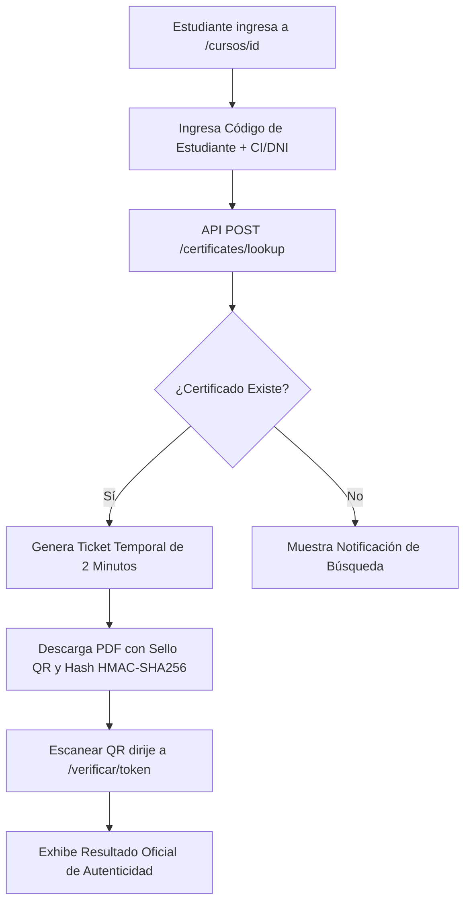

# Arquitectura del Sistema: CertiValida (CONSULTANCY ORGANIZATIONAL LLC)

Este documento detalla la estructura modular desacoplada entre **Frontend (`frontend`)** y **Backend (`backend`)**, así como los estándares de diseño responsivo y seguridad criptográfica implementados.

---

## 📁 1. Estructura de Carpetas del Frontend (`frontend/src`)

El frontend está desarrollado con **Next.js 14 (App Router)**, **TypeScript**, **Tailwind CSS** y **Framer Motion**, organizado estrictamente por dominios de componentes responsivos:

```
frontend/src/
├── app/                              # Rutas principales del portal público y panel admin
│   ├── layout.tsx                    # Layout global claro con Navbar y Footer
│   ├── page.tsx                      # Homepage modular de CONSULTANCY ORGANIZATIONAL LLC
│   ├── cursos/
│   │   ├── page.tsx                  # Catálogo general de clases y buscador
│   │   └── [id]/page.tsx             # Temario detallado de clase (estilo Teresa Baró)
│   ├── certificados/
│   │   └── page.tsx                  # Buscador y verificación pública por código o CI
│   ├── verificar/
│   │   ├── page.tsx                  # Verificador rápido por escaneo de QR
│   │   └── [token]/page.tsx          # Resultado público de autenticidad del diploma
│   ├── contacto/
│   │   └── page.tsx                  # Formulario institucional de contacto
│   └── admin/                        # Panel de control administrativo
│       ├── layout.tsx                # Sidebar navegable del dashboard
│       ├── login/page.tsx            # Autenticación segura de administradores
│       ├── certificates/page.tsx     # Emisión directa y gestión de certificados
│       ├── courses/page.tsx          # Configuración Web de Clases y plantillas
│       └── users/page.tsx            # Usuarios admin y roles
├── components/                       # Componentes modulares desacoplados
│   ├── common/                       # Componentes globales reutilizables
│   │   ├── Navbar.tsx                # Encabezado corporativo con drawer móvil
│   │   └── Footer.tsx                # Pie de página institucional
│   ├── home/                         # Componentes exclusivos de la portada
│   │   ├── HeroSection.tsx           # Hero con retrato de la Coach Deisy Barrera
│   │   ├── AboutCoach.tsx            # Trayectoria profesional y consultoría
│   │   ├── FeaturedCourses.tsx       # Rejilla destacada de clases
│   │   └── SecurityBanner.tsx        # Garantía de seguridad por QR y hash
│   ├── courses/                      # Componentes del módulo de clases
│   │   ├── CourseCard.tsx            # Tarjeta de clase con foto y avatar de la coach
│   │   └── CertificateDownloadForm.tsx # Formulario con Código de Estudiante + CI
│   └── admin/                        # Componentes de administración visual
│       ├── CourseFormModal.tsx       # Edición de contenidos de clases
│       └── VisualTemplateEditorModal.tsx # Canvas interactivo para calibrar diplomas
└── lib/
    └── api.ts                        # Cliente fetch centralizado con manejo de errores
```

---

## 🛠️ 2. Estructura de Carpetas del Backend (`backend/src`)

El backend está desarrollado sobre **NestJS**, **Prisma ORM**, **pdf-lib** y **PostgreSQL**, siguiendo la arquitectura orientada a módulos de NestJS:

```
backend/src/
├── modules/
│   ├── courses/                      # Gestión de clases, temarios y plantillas PDF/PNG
│   │   ├── courses.controller.ts     # Endpoints /courses y /admin/courses
│   │   ├── courses.service.ts        # Lógica de negocio y consultas Prisma
│   │   └── courses.module.ts
│   ├── certificates/                 # Motor de generación PDF, QR y lookup por CI/Código
│   │   ├── certificates.controller.ts# Endpoints /certificates y /admin/certificates
│   │   ├── certificates.service.ts   # Criptografía HMAC-SHA256, Crockford Base32 y pdf-lib
│   │   └── certificates.module.ts
│   ├── participants/                 # Registro y directorio de estudiantes con CI
│   ├── settings/                     # Configuración institucional (Logo, Coach, Redes)
│   ├── auth/                         # Autenticación Argon2, sesiones y cookies HTTP-Only
│   ├── storage/                      # Almacenamiento local seguro de PDFs
│   └── security/                     # Eventos de seguridad, rate limiting y auditoría
├── common/
│   ├── guards/                       # AuthenticatedGuard y RolesGuard
│   ├── filters/                      # HttpExceptionFilter
│   └── decorators/                   # Decoradores de roles y usuario actual
├── prisma/
│   ├── schema.prisma                 # Modelos de datos PostgreSQL (CourseEvent, Participant, Certificate)
│   └── seed.ts                       # Script de carga inicial de clases y estudiantes
└── main.ts                           # Punto de entrada NestJS
```

---

## 📱 3. Estándares de Responsividad y UI

- **Breakpoint Grid**:
  - Móviles (`xs` / `<640px`): Navegación por menú desplegable (drawer), formularios en 1 sola columna, tarjetas adaptadas.
  - Tablets (`sm` / `md` / `640px-1024px`): Rejillas de 2 columnas para clases y temarios.
  - Escritorio (`lg` / `xl` / `>1024px`): Rejillas de 3 columnas, sidebar admin fijo y vistas amplias.
- **Paleta de Colores Ejecutiva (Luminosa)**:
  - Fondo: Blanco puro `#FFFFFF` y Alabastro `#F8FAFC`.
  - Texto: Carbón `#0F172A` y Gris Pizarra `#475569`.
  - Acentos: Azul Marino Corporativo `#0F2C59`, Azul Cobalto `#1E3A8A` y Dorado Warm `#D4AF37`.

---

## 🔐 4. Flujo de Generación y Verificación Criptográfica


